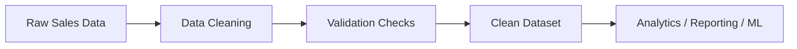

# Data Cleaning Pipeline (Python + Pandas)

## Overview

This project implements a structured data cleaning pipeline that transforms raw, inconsistent sales data into a clean, validated, and analysis-ready dataset.

The pipeline is designed using real-world data engineering practices with a focus on data quality, validation, and reproducibility.

---

## Problem Statement

Raw business data is often incomplete, inconsistent, and unreliable.  
Without proper cleaning, it leads to incorrect analysis, poor decision-making, and operational inefficiencies.

This project addresses these challenges by building a robust data cleaning pipeline.

---

## Solution

A modular data pipeline was developed using Python and Pandas to:

- Clean and standardize raw data
- Handle missing and inconsistent values
- Remove duplicates
- Validate key business metrics
- Output a clean dataset ready for analysis

---

## Dataset

The dataset contains:

- Customer information (name, email, phone)
- Product and regional data
- Sales transactions (quantity, price, discount)

---

## Key Features

- Modular and reusable pipeline design
- Handles real-world data quality issues
- Data validation and integrity checks
- Clean and structured output dataset
- Designed for scalability and reproducibility

---

## Pipeline Architecture



---

## Workflow

The pipeline follows a structured process:

1. Load raw dataset  
2. Clean column names  
3. Handle missing values  
4. Remove duplicates  
5. Standardize categorical values  
6. Validate data integrity  
7. Export clean dataset  

---

## Validation

To ensure data reliability:

- No missing values in critical fields  
- Duplicate records removed  
- Revenue calculations verified  
- Consistent categorical values  
- Clean and structured dataset output  

---

## Output

The final dataset is:

- Clean  
- Consistent  
- Validated  
- Ready for analytics, reporting, or machine learning  

---

## Project Structure

```
data-cleaning-pipeline/
│
├── data/
│   ├── raw/
│   │   └── messy_sales_data.csv
│   ├── processed/
│   │   └── cleaned_sales_final.csv
│
├── main.py
├── README.md
└── requirements.txt
```

This structure ensures:

- Separation of raw and processed data  
- Maintainable and scalable design  
- Clear data flow across the pipeline  

---

## How to Run  

### 1. Clone the Repository  

git clone https://github.com/CoachSam1/data-cleaning-pipeline  

cd data-cleaning-pipeline  

### 2. Install Dependencies  

pip install pandas numpy  

### 3. Run the Pipeline  

python main.py  

### 4. Output  

The cleaned and validated dataset will be saved in:  

data/processed/cleaned_sales_final.csv  

---

## Business Impact  

This project demonstrates the ability to transform raw and inconsistent data into a high-quality, analytics-ready dataset using a structured data cleaning pipeline.  

### Key Value Delivered:  

- Improved data quality and consistency across records  
- Reliable and validated datasets for accurate analysis  
- Reduced manual data cleaning effort through automation  
- Structured pipeline designed for scalability and reuse  
- Clean data ready for business intelligence and analytics  

### Real-World Relevance:  

Poor data quality can lead to incorrect insights, operational inefficiencies, and financial risk.  

This pipeline addresses these challenges by standardizing data, removing invalid records, and ensuring that business metrics are accurate and trustworthy.  

---

## Technologies Used  

- Python  
- Pandas  
- NumPy  

---

## Author  

Developed by a data engineer focused on building reliable, scalable, and production-ready data solutions.
---
